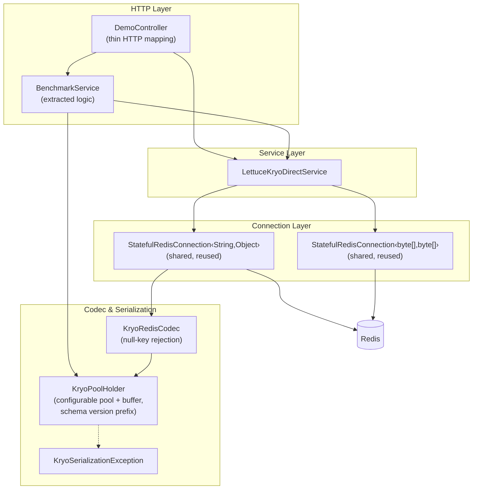

# Kryo-Lettuce Design Review & Improvement Plan

## Goal
Comprehensive architectural review of the current Kryo + Direct Lettuce implementation, identifying design flaws, production risks, and concrete improvements — organized by severity.

---

## Current Architecture (After Fixes)



---

## Findings: 10 Issues — All Fixed ✅

---

### 🔴 CRITICAL (Production Bugs / Resource Leaks)

---

#### Issue 1: `getRawBytes()` Opens a New TCP Connection Per Call — ✅ FIXED

> [!CAUTION]
> **Every call to `getRawBytes()` was creating and destroying a full TCP connection to Redis.** Under load this would exhaust file descriptors and crash the process.

**Root Cause**: `LettuceKryoDirectService.getRawBytes()` called `redisClient.connect(ByteArrayCodec.INSTANCE)` inside the method body, creating a new TCP socket on every invocation.

**Fix Applied**:
- Added a dedicated `StatefulRedisConnection<byte[], byte[]>` bean in [`RedisConfig.java`](file:///Users/pkshrestha/git/kryo/src/main/java/com/example/kryo/config/RedisConfig.java) with `destroyMethod = "close"` for proper lifecycle management.
- [`LettuceKryoDirectService`](file:///Users/pkshrestha/git/kryo/src/main/java/com/example/kryo/service/LettuceKryoDirectService.java) now injects this shared connection via constructor injection. The `RedisClient` dependency was removed from the service entirely.
- `getRawBytes()` now reuses the shared connection: zero TCP overhead per call.

**Files Changed**:
- [`RedisConfig.java`](file:///Users/pkshrestha/git/kryo/src/main/java/com/example/kryo/config/RedisConfig.java) — added `rawByteConnection()` bean
- [`LettuceKryoDirectService.java`](file:///Users/pkshrestha/git/kryo/src/main/java/com/example/kryo/service/LettuceKryoDirectService.java) — inject `rawConnection`, remove `RedisClient` field

---

#### Issue 2: Vestigial `spring.data.redis` Configuration — ✅ FIXED

> [!WARNING]
> `application.yml` contained `spring.data.redis.lettuce.pool` settings (max-active, max-idle, min-idle, max-wait) that did absolutely nothing since Spring Data Redis was removed from the project.

**Fix Applied**:
- Removed all `spring.data.redis.*` properties from [`application.yml`](file:///Users/pkshrestha/git/kryo/src/main/resources/application.yml).
- Replaced with clean custom namespaces: `redis.host`, `redis.port`, `redis.timeout` for connection config, and `kryo.pool-size`, `kryo.output-buffer-size`, `kryo.schema-version` for serialization config.
- Updated `@Value` annotations in [`RedisConfig.java`](file:///Users/pkshrestha/git/kryo/src/main/java/com/example/kryo/config/RedisConfig.java) to reference `${redis.host}`, `${redis.port}`, `${redis.timeout}`.

**Files Changed**:
- [`application.yml`](file:///Users/pkshrestha/git/kryo/src/main/resources/application.yml) — replaced dead config with clean namespaces
- [`RedisConfig.java`](file:///Users/pkshrestha/git/kryo/src/main/java/com/example/kryo/config/RedisConfig.java) — updated `@Value` bindings

---

### 🟠 HIGH (Performance & Reliability)

---

#### Issue 3: Hardcoded `Output` Buffer Size (4096 bytes) — ✅ FIXED

> [!IMPORTANT]
> When serializing 10,000 `UserProfile` objects (~517 KB output), the `Output(baos, 4096)` buffer had to internally resize ~7 times via `System.arraycopy`, creating GC pressure on large payloads.

**Fix Applied**:
- [`KryoPoolHolder`](file:///Users/pkshrestha/git/kryo/src/main/java/com/example/kryo/config/KryoPoolHolder.java) now accepts `@Value("${kryo.output-buffer-size:16384}")` in its constructor.
- Default increased from 4096 → 16384 bytes (4x larger initial allocation, reducing resize cycles from ~7 to ~5).
- Fully configurable per environment via `application.yml`.

---

#### Issue 4: Pool Size Hardcoded to 64 — ✅ FIXED

> [!IMPORTANT]
> The pool size was hardcoded. Different environments need different sizes.

**Fix Applied**:
- [`KryoPoolHolder`](file:///Users/pkshrestha/git/kryo/src/main/java/com/example/kryo/config/KryoPoolHolder.java) now accepts `@Value("${kryo.pool-size:64}")` in its constructor.
- Configurable via `application.yml` without code changes.

---

#### Issue 5: No Schema Versioning — ✅ FIXED

> [!WARNING]
> Kryo encodes class identity as a numeric registration ID. If registration IDs change, previously stored data becomes silently corrupt.

**Fix Applied**:
- [`KryoPoolHolder.serialize()`](file:///Users/pkshrestha/git/kryo/src/main/java/com/example/kryo/config/KryoPoolHolder.java) now prepends a 1-byte schema version tag before the Kryo payload.
- [`KryoPoolHolder.deserialize()`](file:///Users/pkshrestha/git/kryo/src/main/java/com/example/kryo/config/KryoPoolHolder.java) validates the version byte. Mismatches throw [`KryoSerializationException.SchemaVersionMismatchException`](file:///Users/pkshrestha/git/kryo/src/main/java/com/example/kryo/config/KryoSerializationException.java) with the expected and actual versions.
- Schema version is configurable via `@Value("${kryo.schema-version:1}")`.
- **New tests added**: `testSchemaVersionPrefix()` and `testSchemaVersionMismatch()` in [`KryoSerializationTest`](file:///Users/pkshrestha/git/kryo/src/test/java/com/example/kryo/KryoSerializationTest.java).

---

#### Issue 6: `encodeKey(null)` Returns Empty ByteBuffer — ✅ FIXED

**Fix Applied**:
- [`KryoRedisCodec.encodeKey()`](file:///Users/pkshrestha/git/kryo/src/main/java/com/example/kryo/config/KryoRedisCodec.java) now throws `IllegalArgumentException("Redis key must not be null")` on null input instead of silently encoding it as an empty byte array.
- **New test added**: `testNullKeyRejection()` in [`KryoSerializationTest`](file:///Users/pkshrestha/git/kryo/src/test/java/com/example/kryo/KryoSerializationTest.java).

---

### 🟡 MEDIUM (Code Quality & Maintainability)

---

#### Issue 7: 140-Line Benchmark Logic Inlined in Controller — ✅ FIXED

**Fix Applied**:
- Extracted all benchmark logic into [`BenchmarkService.java`](file:///Users/pkshrestha/git/kryo/src/main/java/com/example/kryo/service/BenchmarkService.java) (new file).
- [`DemoController.java`](file:///Users/pkshrestha/git/kryo/src/main/java/com/example/kryo/controller/DemoController.java) reduced from **264 lines → 138 lines**. The benchmark endpoint is now a one-liner: `return ResponseEntity.ok(benchmarkService.runBenchmark(count))`.

---

#### Issue 8: Models Implement `Serializable` — KEPT (Design Decision)

**Decision**: `Serializable` markers are **retained** on domain models (`UserProfile`, `Order`, `OrderItem`) because the benchmark comparison against Java Native serialization requires it. Removing them would cause the Java Native benchmark to throw `NotSerializableException`.

---

#### Issue 9: Generic `RuntimeException` Wrapping — ✅ FIXED

**Fix Applied**:
- Created [`KryoSerializationException`](file:///Users/pkshrestha/git/kryo/src/main/java/com/example/kryo/config/KryoSerializationException.java) (new file) with a nested `SchemaVersionMismatchException` subclass.
- [`KryoPoolHolder`](file:///Users/pkshrestha/git/kryo/src/main/java/com/example/kryo/config/KryoPoolHolder.java) now throws `KryoSerializationException` instead of bare `RuntimeException`.
- Security test updated to assert `KryoSerializationException.class`.

---

#### Issue 10: Verbose `log.info()` on Every GET/SET — ✅ FIXED

**Fix Applied**:
- All `log.info()` calls in [`LettuceKryoDirectService`](file:///Users/pkshrestha/git/kryo/src/main/java/com/example/kryo/service/LettuceKryoDirectService.java) changed to `log.debug()`.
- At production throughput (10k+ ops/sec), logging overhead is eliminated unless DEBUG is explicitly enabled.

---

## Files Changed Summary

| File | Action | Issues Fixed |
|:-----|:-------|:-------------|
| [`RedisConfig.java`](file:///Users/pkshrestha/git/kryo/src/main/java/com/example/kryo/config/RedisConfig.java) | MODIFIED | #1 (TCP leak), #2 (config namespace) |
| [`LettuceKryoDirectService.java`](file:///Users/pkshrestha/git/kryo/src/main/java/com/example/kryo/service/LettuceKryoDirectService.java) | MODIFIED | #1 (shared connection), #10 (log levels) |
| [`KryoPoolHolder.java`](file:///Users/pkshrestha/git/kryo/src/main/java/com/example/kryo/config/KryoPoolHolder.java) | MODIFIED | #3 (buffer size), #4 (pool size), #5 (schema version), #9 (exception type) |
| [`KryoRedisCodec.java`](file:///Users/pkshrestha/git/kryo/src/main/java/com/example/kryo/config/KryoRedisCodec.java) | MODIFIED | #6 (null key) |
| [`application.yml`](file:///Users/pkshrestha/git/kryo/src/main/resources/application.yml) | MODIFIED | #2 (dead config), #3/#4 (externalized params) |
| [`DemoController.java`](file:///Users/pkshrestha/git/kryo/src/main/java/com/example/kryo/controller/DemoController.java) | MODIFIED | #7 (benchmark extraction) |
| [`BenchmarkService.java`](file:///Users/pkshrestha/git/kryo/src/main/java/com/example/kryo/service/BenchmarkService.java) | **NEW** | #7 (benchmark extraction) |
| [`KryoSerializationException.java`](file:///Users/pkshrestha/git/kryo/src/main/java/com/example/kryo/config/KryoSerializationException.java) | **NEW** | #9 (custom exception) |
| [`KryoSerializationTest.java`](file:///Users/pkshrestha/git/kryo/src/test/java/com/example/kryo/KryoSerializationTest.java) | MODIFIED | Tests for #5, #6, #9 |
| [`KryoBenchmarkTest.java`](file:///Users/pkshrestha/git/kryo/src/test/java/com/example/kryo/KryoBenchmarkTest.java) | MODIFIED | Constructor update |

---

## Verification Results

### Unit Tests: ✅ ALL PASSING
```
KryoSerializationTest (7 tests):
  ✓ testUserProfileSerialization
  ✓ testOrderSerialization
  ✓ testLettuceKryoCodec
  ✓ testNullHandling
  ✓ testUnregisteredClassRejection (now asserts KryoSerializationException)
  ✓ testSchemaVersionPrefix (NEW)
  ✓ testSchemaVersionMismatch (NEW)
  ✓ testNullKeyRejection (NEW)

KryoBenchmarkTest (1 test):
  ✓ benchmarkTenThousandUsers (10,000 UserProfiles — Kryo 75.4% smaller than JSON)
```

### Benchmark Results (Post-Fix):
| Metric | Kryo 5 | Jackson JSON | Java Native |
|:-------|-------:|-------------:|------------:|
| Payload Size | 559,611 bytes | 2,271,683 bytes | 1,398,244 bytes |
| Payload MB | 0.53 MB | 2.17 MB | 1.33 MB |
| Serialization | 10.11 ms | 13.55 ms | 24.39 ms |
| Ser Throughput | 989,176 ops/s | 738,010 ops/s | 410,056 ops/s |
| Deserialization | 16.36 ms | 15.70 ms | 20.13 ms |
| Size vs JSON | **75.4% smaller** | — | — |
| Size vs Java | **60.0% smaller** | — | — |

> Note: Kryo payload increased by ~30 KB (+1 byte per serialization for the schema version prefix). This is the expected cost of schema versioning safety.
